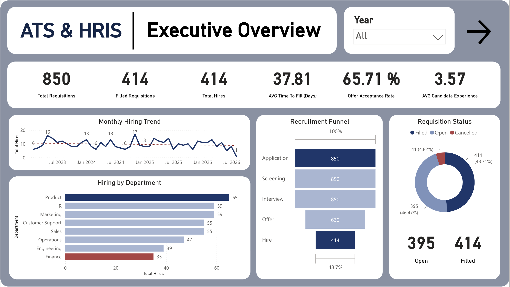
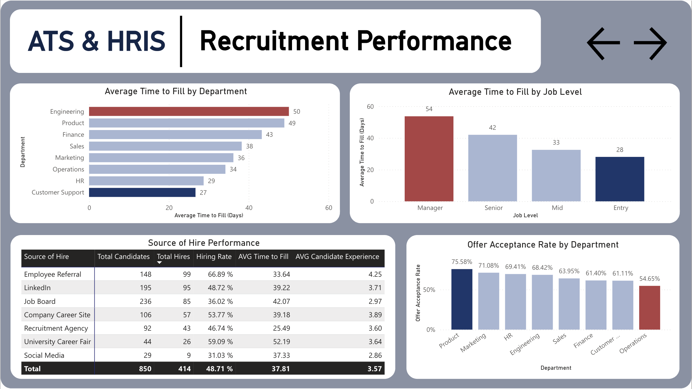
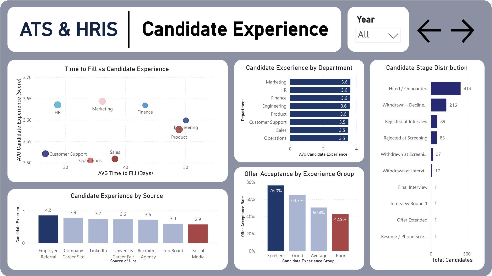
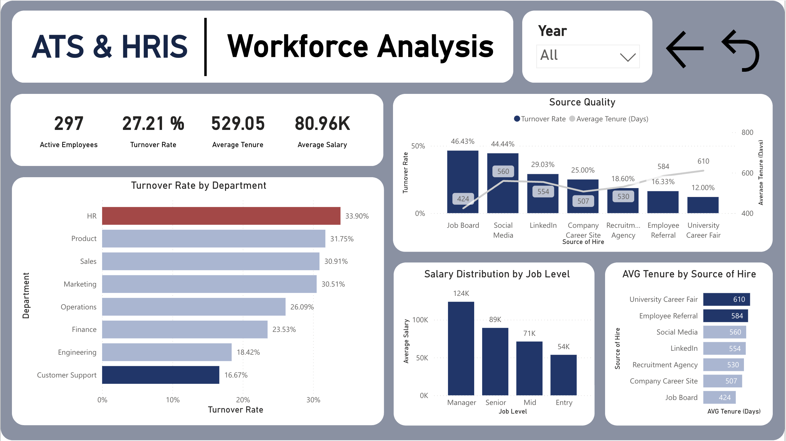

# Talent Acquisition & Workforce Analytics
### ATS & HRIS | SQL | Power BI | DAX | Excel | Python

## 1. Overview

Analyzed recruitment and employee data by integrating Applicant Tracking System (ATS) and Human Resource Information System (HRIS) datasets to evaluate hiring efficiency, candidate experience, recruitment quality, and employee retention across the entire hiring lifecycle.

---

## 2. Business Problem

The HR team needed better visibility into recruitment effectiveness and long-term hiring quality. While hiring metrics such as the number of applications and hires were available, they lacked insights into which recruitment channels produced the best employees and how recruitment performance impacted workforce outcomes.

This project was designed to answer the following stakeholder questions:

- How efficient is the recruitment process from application to hire?
- Which departments require the longest time to fill vacancies?
- Which recruitment sources generate the highest-quality hires?
- How does candidate experience influence offer acceptance?
- Which hiring channels produce employees with the strongest long-term retention?
- Which departments experience the highest employee turnover?

---

## 3. Tools & Process

### SQL

- Joined ATS recruitment data with HRIS employee records using Candidate ID
- Built recruitment KPIs including Total Requisitions, Total Hires, Hiring Rate, Offer Acceptance Rate, and Average Time to Fill
- Analyzed recruitment performance by department, job level, and source of hire
- Evaluated candidate experience throughout the recruitment process
- Measured workforce KPIs including Active Employees, Turnover Rate, Average Salary, and Average Employee Tenure
- Generated aggregated datasets to support Power BI dashboard development

### Python

- Used for basic data inspection before analysis, including checking table structure, data types, missing values, duplicates, and summary statistics

### Power BI

- Built a star schema integrating ATS and HRIS datasets
- Created DAX measures for Hiring Rate, Offer Acceptance Rate, Average Time to Fill, Candidate Experience, Turnover Rate, Active Employees, Average Salary, and Average Tenure
- Designed a four-page interactive dashboard covering recruitment overview, hiring performance, candidate experience, and workforce analytics
- Implemented interactive filters to analyze recruitment performance across departments, hiring channels, and time periods

---

## 4. Key Findings

- The organization processed **850 recruitment requisitions**, resulting in **414 successful hires**, with an overall hiring rate of **48.7%**.
- Engineering positions required the longest recruitment cycle, averaging **50 days**, while Customer Support roles averaged only **27 days**, highlighting significant differences in hiring complexity across departments.
- Manager-level positions required approximately **54 days** to fill, nearly twice as long as Entry-level positions (**28 days**).
- **Employee Referral** was the highest-performing recruitment source, achieving a **66.9% hiring rate**, an average candidate experience score of **4.25/5**, and one of the lowest employee turnover rates (**16.3%**).
- **Job Boards** generated the largest applicant volume but produced the highest employee turnover (**46.4%**) and the shortest average employee tenure (**424 days**), indicating lower long-term hiring quality.
- Candidates reporting an **Excellent** recruitment experience achieved a **76.0% offer acceptance rate**, compared with only **42.9%** among candidates with a **Poor** experience.
- The **HR department** experienced the highest employee turnover (**33.9%**), while Customer Support recorded the lowest turnover (**16.7%**).

---

## 5. Dashboard Preview

### Interactive Dashboard

Explore the live Power BI dashboard here:

[Open Interactive Power BI Dashboard](https://app.powerbi.com/reportEmbed?reportId=fb45ba3e-68f6-4cdc-996e-b7c161a0d813&autoAuth=true&ctid=fe3fbfc3-740c-40d3-a502-14423e1ca052)

---

### 1) Executive Overview



---

### 2) Recruitment Performance



---

### 3) Candidate Experience



---

### 4) Workforce Analysis



---

## 6. Recommendations

### 1) Expand Employee Referral Programs

Employee Referral consistently delivered the highest hiring quality, strongest candidate experience, and one of the lowest employee turnover rates. Increasing referral incentives could improve both recruitment efficiency and workforce retention.

### 2) Reduce Hiring Time for Engineering and Product Roles

Engineering and Product positions required the longest recruitment cycles. Building proactive talent pipelines, simplifying interview stages, and improving recruiter coordination could shorten hiring lead time.

### 3) Improve Candidate Experience Throughout Recruitment

Candidate experience showed a strong relationship with offer acceptance. Organizations should streamline communication, reduce interview delays, and provide timely feedback to improve candidate satisfaction and increase offer acceptance.

### 4) Reevaluate Job Board Recruiting Strategy

Although Job Boards generated a high number of applicants, hires from this channel experienced the highest turnover and the shortest tenure. Additional screening methods or alternative sourcing strategies should be considered to improve hiring quality.

### 5) Monitor Workforce Quality Beyond Hiring Volume

Recruitment success should not be measured solely by the number of hires. Organizations should continuously track employee retention, average tenure, turnover rate, and candidate experience to evaluate the long-term effectiveness of recruitment strategies.

### 6) Investigate High Turnover in the HR Department

The HR department recorded the highest employee turnover. Further investigation into workload, career progression, compensation, or management practices is recommended to improve employee retention.

---

## 7. Project Structure

```text
talent-acquisition-workforce-analytics/
│
├─ README.md
├─ sql/
│  ├─ kpi_summary.sql
│  ├─ recruitment_funnel.sql
│  ├─ hiring_trend.sql
│  ├─ time_to_fill.sql
│  ├─ department_analysis.sql
│  ├─ source_of_hire.sql
│  ├─ offer_acceptance.sql
│  ├─ candidate_experience.sql
│  ├─ recruiter_performance.sql
│  ├─ hiring_manager_performance.sql
│  ├─ turnover_analysis.sql
│  ├─ source_quality.sql
│  ├─ salary_analysis.sql
│  ├─ tenure_analysis.sql
│  └─ executive_summary.sql
│
├─ powerbi/
│  └─ talent_acquisition_dashboard.pbix
│
├─ assets/
│  ├─ executive-overview.png
│  ├─ recruitment-performance.png
│  ├─ candidate-experience.png
│  └─ workforce-analysis.png
│
└─ docs/
   ├─ business_questions.md
   ├─ star_schema.md
   └─ dax_measures.md
```

---

## 8. Skills Demonstrated

- SQL joins and aggregation
- Recruitment funnel analysis
- HR analytics and workforce analytics
- KPI development for ATS and HRIS
- Candidate experience analysis
- Employee retention analysis
- Python basic data inspection
- Power BI dashboard development
- DAX measures
- Star schema data modeling
- Interactive dashboard design
- Business storytelling and executive reporting
